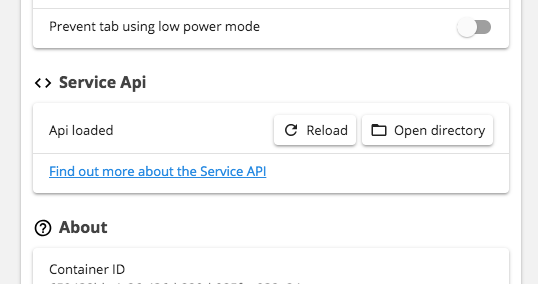

The Wavebox Service API provides a way to customise and enhance services within the [Wavebox app](https://github.com/wavebox/waveboxapp/). It provides means to inject functionality into specific pages and bubble up information to the Wavebox app that can be useful when specific tabs aren't available.

You can use the Service API to:

* Show an unread badge and activity on a specific service
* Show information in the tray about unread items on a page
* Hook into the Quick Search <kbd>CmdOrCtrl</kbd>+<kbd>T</kbd> to give keyboard actions

# Getting Started

### Supported versions and Services
We're working on adding support to all account types in Wavebox, with version 4.7.12+ all apps in the store are supported, with the exception of Gmail, Google Inbox, Outlook, Office 365, Trello, Slack & the Any web link. (Support coming soon).

### Using the API
To use the API, first you need to add an account to the Wavebox app. Once done, open the account settings and scroll down to the `Service API` section



Clicking on the `Open directory` button will open the service api directory for this account type. To get started you need to create a `manifest.json` file in this directory which the app can use to load your custom configuration.

### Reloading

Each time the app is started, it will reload your `manifest.json` file. Linked scripts and styles are reloaded every time they are used for convenience. If you need to reload your manifest file without restart the app, you can use the reload button under the Service Api section in settings.


# API

## Manifest
The `manifest.json` file responds to the following settings:

| Name       | Type       | Required   | Default    | Info       |
| ---------- | ---------- | ---------- | ---------- |---------- |
| supportsUnreadActivity | Bool | No | true | Whether the service supports the unread activity dot |
| supportsUnreadCount | Bool | No | true | Whether the service supports the unread count |
| supportsTrayMessages | Bool | No | true | Whether the service supports placing items in the tray |
| supportsWBGAPI | Bool | No | false | True if the service should support the guest page writing `unreadActivity`, `unreadCount` and `trayMessages`. To access these fields you can use an adaptor |
| supportsGuestNotifications | Bool | No | true | Whether the service supports HTML5 browser notifications |
| html5NotificationsGenerateUnreadActivity | Bool | No | true | If set to true a new HTML5 browser notification will automatically create an unread dot until the service is opened |
| documentTitleHasUnread | Bool | No | true | True if the document title has the unread count |
| documentTitleUnreadBlinks | Bool | No | false | If the document title has the unread count but also blinks set this to true so the app can cope with this case |
| faviconUnreadActivityRegexp | Bool | No | undefined | If the pages favicon indicates unread activity, the regexp string provided here will run over the favicon url. A match will indicate unread activity |
| adaptors | Bool | No | [] | An array of adaptors that are run on page load. See the adaptor section for more |
| commands | Bool | No | [] | An array of commands that the user can execute from the Quick Search. See the command section for more |


## Adaptors
Adaptors are scripts and styles that are injected into certain pages on dom-ready. These can be used, for example to pull the unread count out of the dom and bubble it up to the app. Adaptors are split into two parts, firstly the the manifest entry, secondly the linked code

### Manifest Entry
Each adaptor in the entry responds to the following settings:

| Name       | Type       | Required   | Default    | Info       |
| ---------- | ---------- | ---------- | ---------- |---------- |
| matches    | Array      | Yes        | -          | An array of urls to match. When a match is encountered the adaptor will be executed. Internally the app uses [url-pattern](https://www.npmjs.com/package/url-pattern) for matching |
| js         | File | No | undefined | The JavaScript to execute when the page is ready. In this field place the name of the file to load relative to the manifest path |
| styles     | File | No | undefined | The CSS to execute when the page is ready. In this field place the name of the file to load relative to the manifest path |

### In-page Guest API

##### wavebox.badge.setCount
Sets the unread count on the service badge

* **count (int)** the count to display

```js
window.wavebox.badge.setCount(10)
```

##### wavebox.badge.setHasUnreadActivity
Sets if the service has unread activity

* **has (bool)** true to show the activity indicator, false to hide

```js
window.wavebox.badge.setHasUnreadActivity(true)
```

##### wavebox.tray.setMessages
Sets the list of messages in the tray

* **messages (array)** an array of messages to display to the user

Each message item provided should validate as so:

* **id=auto (string:max=100)** a unique id for this message. Providing this helps improve performance
* **text (string:max=100)** text to display to the user
* **title (string:max=100)** *(Version 4.8.5+)* title text to display to the user. *Note if title and text are both supplied, title will be used*
* **subtitle (string:max=100)** *(Version 4.8.5+)* subtitle text to display to the user
* **date=auto (int)** epoch time of the message which can be used for ordering. Will also support incrementing numbers for ordering

```js
window.wavebox.tray.setMessages([
	{
		id: 'message_id_1',
		title: 'Joe Bloggs',
		subtitle: 'You have a message',
		date: 1516022635099
	}
])
```

##### wavebox.api.version [prop]
The current API version

```js
console.log(window.wavebox.api.version) //0.0.1-alpha
```

## Commands
Commands provide a way for the user to access quick actions from the Quick Search. This could be composing an email, searching for a tweet etc. Commands can either direct the user to a specific url or run a script on a page or a combination of both. Commands are split into two parts, firstly the the manifest entry, secondly the linked code

### Manifest Entry
Each adaptor in the entry responds to the following settings:

| Name       | Type       | Required   | Default    | Info       |
| ---------- | ---------- | ---------- | ---------- |---------- |
| modifier    | String      | Yes        | -          | One of `/` `#` `@` `$`. Provides the search modifier that the user can enter |
| keyword | String | Yes | - | The keyword the user must use to run the command. For example `tweet` |
| helper | String | No | undefined | The helper text that might inform the user on the command layout |
| description | String | Yes | - | The description that's displayed to the user before they run the command |
| url | String | No | undefined | The url to open when the user executes the command. See below for more info |
| js | File | No | undefined | The JS to execute in the page. In this field place the name of the file to load relative to the manifest path |


### Urls
The url is automatically opened in the running service. If the provided url is already open, the page will not be reloaded. To access the command that the user has entered you can use `{{args}}` within your url and the command arguments will be substituted to the url. For example

* **Url:** `https://google.com?q={{args}}`
* **User types:** `/search wavebox app`
* **Opened Url:** `https://google.com?q=wavebox%20app`

### JavaScript
When the JavaScript is executed information about the run search is provided as the following variables so that the behaviour can be customised...

* `modifier`: The modifier ran (e.g. `/`)
* `keyword`: The keyword user (e.g. `search`)
* `args`: The remaining arguments in the command (e.g. `wavebox app`)
* `fullCommand`: The full un-parsed command the user entered (e.g. `/search wavebox app`)

# Debugging

Each time the app reads the JSON manifest, it outputs a log in the same directory. This will provide information as to why and when a load of your manifest has failed.

Adaptors and JavaScript Commands and run within the guest page. You can use the developer tools to debug why your code may have failed at runtime. Developer tools are available...

* Right click > Inspect Element
* Main Window Menus > View > Developer > Developer Tools
* <kbd>Cmd</kbd>+<kbd>Alt</kbd>+<kbd>I</kbd> on macOS <kbd>Ctrl</kbd>+<kbd>Shift</kbd>+<kbd>I</kbd> on windows and linux

# Examples

Examples can be found in the examples folder:

* **Commands** See the [Twitter example](/examples/twitter), [Outlook example](/examples/outlook) and [Gmail example](/examples/gmail)
* **Adaptors** See the [Google Hangouts](/examples/hangouts)

# Contributing

Side-loading your service customisations is just the first step. If you want to include them in the App Store entries, just open up a Pull Request on this repository and place your changes under the `appstore` folder. The Wavebox team will review them and add them into the store entries.